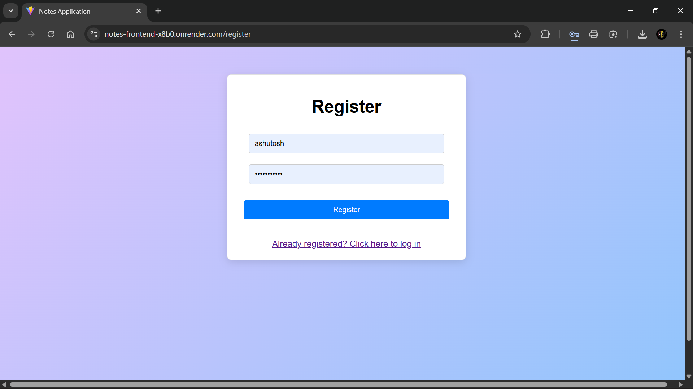
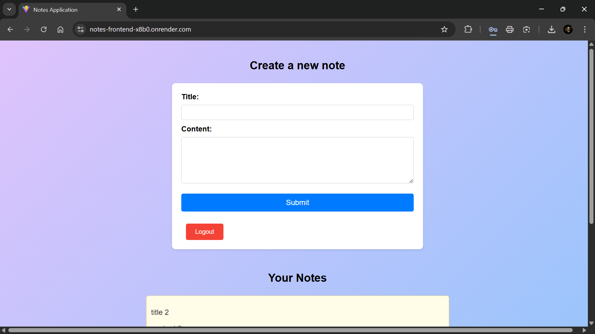
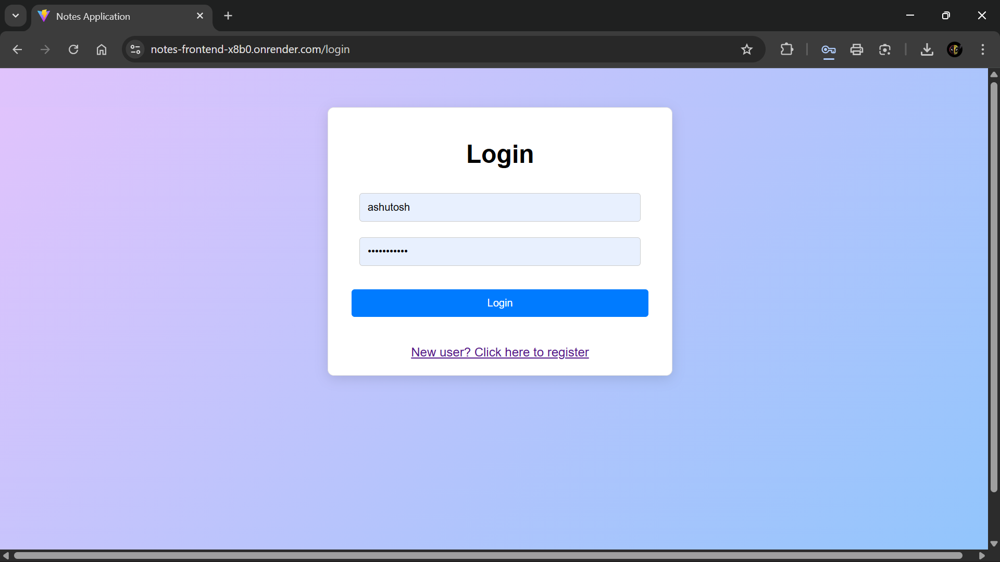
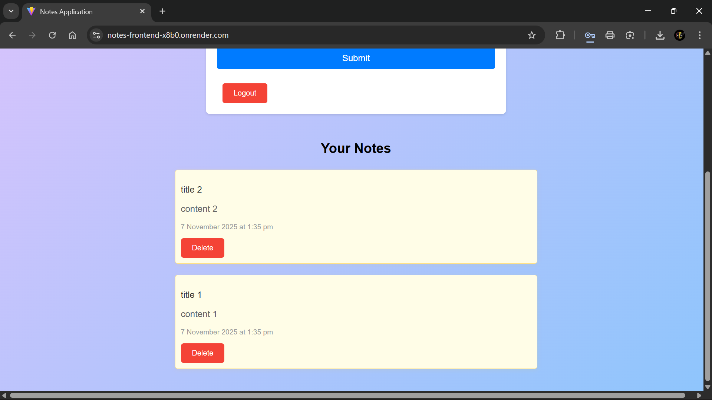

# 📝 Notes Application

[](https://notes-frontend-x8b0.onrender.com/login)

<p align="left">
  
  
  
  
  
  
  
</p>

---

## 📘 Project Overview

**Notes Application** is a secure, full-stack web app that allows users to register, log in, and manage their personal notes.  
Each user has **isolated access** to their data — ensuring privacy and data security. The app follows a **RESTful architecture** with a **React SPA frontend** consuming a **Django REST Framework API**.

---

## ✨ Core Features

- 🔐 **User Authentication** — Registration, login, logout (JWT-based)
- 🧠 **Notes Management** — Create, view, and delete personal notes
- 🔄 **Token Refresh System** — Automatic access token renewal
- 🧍 **User Isolation** — Each user sees only their own notes
- ⚙️ **Backend-Frontend Integration** — React consumes Django REST API
- 💬 **Error Handling & Feedback** — User-friendly messages, loaders, and validation alerts
- 📱 **Responsive UI** — Works seamlessly on mobile and desktop

---

## 🏗️ Architecture & Tech Stack

| Layer | Technology |
|--------|-------------|
| **Backend** | Django 5.2.4, Django REST Framework, SimpleJWT |
| **Database** | SQLite3 (development) / PostgreSQL-ready |
| **Frontend** | React 18.2.0, Vite 5.2.10, Axios |
| **Authentication** | JWT (stateless auth) |
| **Styling** | CSS Modules + Inline Styles |
| **Dev Tools** | ESLint, dotenv, CORS Headers |

---

## 🧩 Project Structure

```
Django-React Notes App/
├── backend/ # Django Backend
│ ├── api/ # Main app (models, views, serializers, urls)
│ ├── backend/ # Project settings (JWT, CORS, DB)
│ ├── manage.py # Django management script
│ ├── db.sqlite3 # Local database
│ └── requirements.txt # Backend dependencies
│
├── frontend/ # React Frontend
│ ├── src/
│ │ ├── api.js # Axios instance (with interceptors)
│ │ ├── constants.js # Token storage keys
│ │ ├── App.jsx # Main app with routes
│ │ ├── components/ # Reusable UI components
│ │ ├── pages/ # Page components (Home, Login, Register)
│ │ ├── styles/ # CSS files
│ │ └── main.jsx # Entry point
│ ├── package.json
│ └── vite.config.js
│
├── screenshots/ # Project screenshots
└── env/ # Python virtual environment
```

---

## 🧱 Security Highlights

### 🔒 Backend
- Passwords hashed securely by Django  
- JWT authentication (stateless + token expiration)  
- CSRF and SQL injection protection via middleware & ORM  
- Data isolation per authenticated user  
- Input validation through DRF serializers  

### 🖥️ Frontend
- JWT tokens stored in `localStorage`  
- Automatic token injection via Axios interceptors  
- Protected routes using `ProtectedRoute`  
- Graceful error handling with visual feedback  

---

## ⚙️ Error Handling

| Type | Example | Response |
|------|----------|-----------|
| **400** | Validation Error | Form-level messages |
| **401** | Invalid Token | Redirect to login |
| **403** | Unauthorized Access | Denied screen |
| **404** | Not Found | Custom 404 page |
| **500** | Server Error | Display fallback message |

---

## 🖼️ Screenshots

| Login / Signup Page | Notes Dashboard |
|-------------|----------------|
|  |  |
|  |  |

---

## 🚧 Potential Improvements

### 🗄️ Backend
- Add note editing & pagination  
- Introduce search, filters, and categories  
- Rate limiting, logging, and API versioning  
- Add unit tests & CI/CD pipeline  

### 🖥️ Frontend
- Add note editing & live updates  
- Implement optimistic UI for better UX  
- Add dark mode & animations  
- Improve loading states  

### 🔐 Security & DevOps
- Token blacklisting for logout  
- HTTPS enforcement  
- XSS & input sanitization  
- Dockerize for deployment  

---

## 👨‍💻 Author

**Ashutosh Kumar Singh**  
- 🌐 [Portfolio](https://ashutosh-12505.vercel.app/)  
- 💼 [LinkedIn](https://www.linkedin.com/in/ashutosh12505/)  
- 💻 [GitHub](https://github.com/ashutosh12505)

---

<p align="center">
  <i>“Code securely. Design thoughtfully. Deliver confidently.”</i>
</p>
